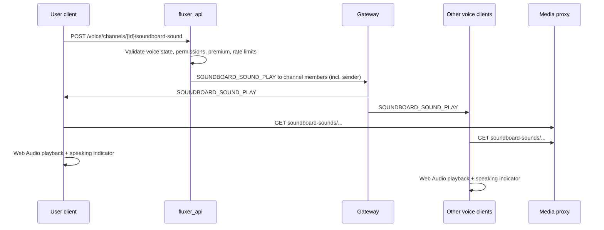

# Soundboard for Voice Chat Plan

Discord-style soundboard for guild voice channels: server-uploaded sounds, default built-in sounds, and premium cross-server usage.

Status: planning only (not implemented).

Roadmap reference: [Roadmap 2026 — soundboard clips](https://fluxer.app/blog/roadmap-2026) (listed under future voice features).

---

## Goals

- Let communities upload short audio clips to a **guild soundboard** (manageable in server settings)
- Let members play those sounds while connected to a voice channel in that guild
- Ship a set of **default sounds** available to everyone (no upload required)
- Let **Plutonium (premium) subscribers** play sounds from other guilds they belong to, when permissions allow — mirroring Discord Nitro + `USE_EXTERNAL_SOUNDS`
- Reuse Fluxer’s existing voice stack (LiveKit / native engine) without publishing a new RTC audio track
- Fit self-hosting: no third-party API keys; sounds stored on the instance’s object storage and served via media proxy

## Non-goals (initial implementation)

- Bots playing soundboard sounds (Discord disallows this; keep parity)
- Federated / cross-instance soundboard (sounds are instance-local until federation exists)
- Injecting soundboard audio into the user’s microphone WebRTC track (recordings/clips would not capture it; same as Discord’s model)
- User-owned personal soundboard libraries separate from guild sounds (entrance sounds already cover personal audio; see [Relationship to entrance sounds](#relationship-to-entrance-sounds))
- Soundboard in text channels
- Auto-playing a soundboard clip on every voice join (entrance sounds are a separate premium feature today; optional convergence later)
- Stage-channel-only restrictions beyond normal voice permissions (treat stage like voice until stage channels ship)

---

## Reference: Discord Soundboard

Primary docs:

- [Discord Soundboard Resource](https://docs.discord.com/developers/resources/soundboard)
- [Soundboard FAQ](https://support.discord.com/hc/en-us/articles/12612888127767-Soundboard-FAQ)
- [Community blog post](https://discord.com/blog/ready-your-airhorns-discord-soundboard-is-coming)

### Behaviour summary

| Area | Discord behaviour | Fluxer target |
|------|-------------------|---------------|
| Default sounds | Global catalog (`GET /soundboard-default-sounds`) | Bundled static assets + API list |
| Guild sounds | Uploaded per server; stored on CDN | `soundboard-sounds/{guild_id}/…` via media proxy |
| Play in voice | `POST /channels/{id}/send-soundboard-sound` | `POST /voice/channels/{id}/soundboard-sound` |
| Delivery | `VOICE_CHANNEL_EFFECT_SEND` gateway event; clients play locally | New `SOUNDBOARD_SOUND_PLAY` gateway event (same pattern as entrance sounds) |
| Upload permission | `CREATE_GUILD_EXPRESSIONS` | `CREATE_EXPRESSIONS` (existing) |
| Manage others’ sounds | `MANAGE_GUILD_EXPRESSIONS` | `MANAGE_EXPRESSIONS` (existing) |
| Play permission | `SPEAK` + `USE_SOUNDBOARD` | `SPEAK` + new `USE_SOUNDBOARD` |
| Cross-server play | Nitro + `USE_EXTERNAL_SOUNDS` | Premium + new `USE_EXTERNAL_SOUNDS` |
| File limits | 512 KB, max ~5.2 s, MP3/OGG | Reuse `EntranceSoundConstants` limits (already 5.2 s / 1 MB for entrance sounds; align to 512 KB for guild sounds to match Discord) |
| Guild slot limits | 8 base, up to 48 via boosts; `MORE_SOUNDBOARD` → 96 | Use limit config (`max_guild_soundboard_sounds`) + optional `MORE_SOUNDBOARD` guild feature |
| Bots | Cannot play | Cannot play |
| Join sound (Nitro) | Optional auto-play on voice join from soundboard | Defer; entrance sounds already exist |

### Discord sound object (for schema alignment)

```json
{
  "name": "Yay",
  "sound_id": "1106714396018884649",
  "volume": 1,
  "emoji_id": "989193655938064464",
  "emoji_name": null,
  "guild_id": "613425648685547541",
  "available": true,
  "user": { }
}
```

Default sounds omit `guild_id` and use low numeric `sound_id` values.

---

## Current Architecture (what already exists)

### Voice media path

Voice runs through **Voice Engine V2** on top of **LiveKit** (web) or the **native voice engine** (desktop). Local microphone audio is published as a standard RTC track. Auxiliary audio (entrance sounds) is **not** mixed into that track.

Key locations:

| Area | Location |
|------|----------|
| Voice engine facade | `fluxer_app/src/features/voice/engine/MediaEngineFacade.ts` |
| LiveKit data channel | `VoiceEngineV2AppLiveKitExecutionAdapter.publishData()` |
| Voice control UI | `fluxer_app/src/features/voice/components/VoiceControlBar.tsx` |
| Speaking indicators | `setVoiceEngineV2ParticipantAudioLevelSpeaking()` |

### Entrance sounds (closest existing feature)

Fluxer already implements **premium voice entrance sounds** end-to-end. Soundboard should copy this delivery model.

| Layer | Location | Notes |
|-------|----------|-------|
| Constants | `packages/constants/src/EntranceSoundConstants.ts` | 5.2 s max, MP3/OGG/M4A/WAV, 8 sounds/user |
| API upload/library | `fluxer_api/src/api/user/entrance_sound/EntranceSoundService.ts` | Base64 upload, ffprobe duration, S3 storage |
| API play | `fluxer_api/src/api/user/entrance_sound/EntranceSoundPlayService.ts` | Fans out gateway event to channel members |
| Play endpoint | `POST /voice/channels/:channel_id/entrance-sound` | Documented: clients fetch CDN audio locally |
| Gateway event | `ENTRANCE_SOUND_PLAY` | Registered in `fluxer_gateway/src/utils/event_atoms.erl` |
| Client playback | `fluxer_app/src/features/voice/engine/EntranceSoundPlaybackEngine.ts` | Web Audio API → output device; fakes speaking indicator |
| Client handler | `fluxer_app/src/features/voice/events/EntranceSoundPlay.ts` | |
| Trimmer UI | `fluxer_app/src/features/voice/components/EntranceSoundTrimmerModal.tsx` | Drag handles, 5.2 s cap |
| Media proxy | `fluxer_media_proxy/src/server.rs` | `/entrance-sounds/{user_id}/{hash}.{ext}` |
| Premium gate | `feature_voice_entrance_sounds` limit toggle | Settings UI in `EntranceSoundSection.tsx` |
| Rate limit | `VOICE_ENTRANCE_SOUND_PLAY`: 3 / 30 s per user per channel | `ChannelRateLimitConfig.ts` |

OpenAPI on the play endpoint explicitly states the architecture soundboard should follow:

> The other clients then fetch the audio from CDN and play it locally; **no LiveKit track is published**.

### Expressions (guild asset pattern to mirror)

Guild emojis/stickers provide the CRUD, audit log, moderation, and gateway dispatch patterns soundboard uploads should reuse:

| Concern | Pattern |
|---------|---------|
| Service | `EmojiService` / `StickerService` in `fluxer_api/src/api/guild/services/content/` |
| Repository | `GuildContentRepository` + Cassandra tables |
| Controllers | `GuildEmojiController`, `GuildStickerController` |
| Gateway | `GUILD_EMOJIS_UPDATE`, `GUILD_STICKERS_UPDATE` |
| Permissions | `CREATE_EXPRESSIONS`, `MANAGE_EXPRESSIONS` |
| Limits | `max_guild_emojis`, guild features `MORE_EMOJI`, `UNLIMITED_EMOJI` |

### Premium / cross-guild expressions

| Concern | Location |
|---------|----------|
| Premium check | `fluxer_api/src/api/user/UserHelpers.ts` → `checkIsPremium()` |
| Cross-guild emoji/sticker | `USE_EXTERNAL_EMOJIS`, `USE_EXTERNAL_STICKERS` permissions |
| Premium perk | `feature_global_expressions` in `LimitTierPerks.ts` (`global_emoji_sticker_access`) |
| Self-hosted everyone-premium | `InstanceConfig` premium mode `everyone` |

### Placeholder UI hooks (soundboard-specific)

Already wired but not implemented:

| Hook | Location |
|------|----------|
| Keybind `Ctrl+Shift+B` | `fluxer_app/src/features/input/state/InputKeybind.ts` |
| Handler dispatches `SOUNDBOARD_TOGGLE` | `fluxer_app/src/features/app/keybindings/keybind_manager/handlers/defaultHandlers.ts` |
| Component bus event | `fluxer_app/src/features/platform/utils/ComponentBus.ts` |
| i18n label | `TOGGLE_THE_SOUNDBOARD_DESCRIPTOR` |

No listener subscribes to `SOUNDBOARD_TOGGLE` yet.

### Permissions gap

`packages/constants/src/ChannelConstants.ts` has no `USE_SOUNDBOARD` or `USE_EXTERNAL_SOUNDS` bits yet. External emoji/sticker bits exist at `1n << 18n` and `1n << 37n`; new bits must be allocated without collision.

---

## Proposed Architecture

### High-level flow



**Design choice:** Fan out to **all** channel members including the sender. Entrance sounds exclude the sender (they already know they played it); soundboard should include the sender so they hear their own clip without a separate local-only code path.

### Audio delivery model

1. **No RTC publish** — avoids echo cancellation conflicts, E2EE complexity, and server-side mixing.
2. **Web Audio / native equivalent** — extend `EntranceSoundPlaybackEngine` into a shared `VoiceEffectPlaybackEngine` (or thin wrapper).
3. **Speaking indicator** — pulse the player’s tile while the clip plays (entrance sounds already do this).
4. **Volume chain** — `sound.volume` × user soundboard volume × voice output volume × master notification volume × per-user listener override.
5. **Deafen / mute / suppress** — block sending (API) if user is server-muted, self-deafened, or suppressed; block receiving if locally deafened (client).
6. **Streamer mode** — respect `StreamerMode.shouldDisableSounds` (entrance sounds already check this).

### E2EE note

Voice E2EE encrypts RTC media frames, not gateway side-channel events. Soundboard clips will be audible to clients in the channel but are metadata + CDN fetches outside the E2EE media path — same class of limitation as entrance sounds and speaking indicators. Document for communities using `VOICE_E2EE`.

---

## Data Model

### Guild soundboard sound (Cassandra)

New table `guild_soundboard_sounds` (+ optional `guild_soundboard_sounds_by_sound_id` index table mirroring emoji/sticker layout):

| Column | Type | Notes |
|--------|------|-------|
| `guild_id` | snowflake | partition key |
| `sound_id` | snowflake | clustering key |
| `name` | text | 2–32 chars |
| `creator_id` | snowflake | uploader |
| `hash` | text | content hash for CDN path |
| `extension` | text | `mp3` \| `ogg` (prefer mp3/ogg for Discord parity; optionally allow m4a/wav like entrance sounds) |
| `duration_ms` | int | probed on upload |
| `volume` | double | 0.0–1.0, default 1.0 |
| `emoji_id` | snowflake? | optional guild emoji icon |
| `emoji_name` | text? | optional unicode emoji |
| `available` | boolean | admin disable without delete |
| `nsfw` | boolean | from media scan |
| `version` | int | optimistic locking |

Storage path: `soundboard-sounds/{guild_id}/{hash}.{extension}`

CDN URL: `{media_endpoint}/soundboard-sounds/{guild_id}/{hash}.{extension}`

### Default sounds

Option A (recommended): **static catalog** in `packages/constants/src/DefaultSoundboardSounds.ts` + audio files in `fluxer_static/soundboard/`, shipped with the app; no upload, `guild_id = null`, synthetic IDs `1`…`N`.

Option B: API-served list from instance config (operator-customizable defaults). More flexible for self-hosters; more ops work.

Start with **Option A**; add operator overrides later if requested.

### Client-side caches

| Cache | Purpose |
|-------|---------|
| `AudioBuffer` LRU | Reuse decode work (entrance engine uses hash-keyed cache, limit 16) |
| Guild sound list | From `GUILD_SOUNDBOARD_SOUNDS_UPDATE` + lazy fetch |
| Recent / favorites | User preference proto extension (optional phase 2) |

---

## API Design

### Guild management

| Method | Path | Permission | Notes |
|--------|------|------------|-------|
| `GET` | `/guilds/{guild_id}/soundboard-sounds` | member | List guild sounds |
| `GET` | `/guilds/{guild_id}/soundboard-sounds/{sound_id}` | member | Single sound |
| `POST` | `/guilds/{guild_id}/soundboard-sounds` | `CREATE_EXPRESSIONS` | Upload (base64 audio + metadata) |
| `PATCH` | `/guilds/{guild_id}/soundboard-sounds/{sound_id}` | creator + `CREATE_EXPRESSIONS`, or `MANAGE_EXPRESSIONS` | Update name/volume/emoji |
| `DELETE` | `/guilds/{guild_id}/soundboard-sounds/{sound_id}` | same as patch | |
| `GET` | `/soundboard-default-sounds` | public / authed | Default catalog |

Follow emoji/sticker OpenAPI style in `GuildStickerController.ts`. Support `X-Audit-Log-Reason`.

### Play in voice

```
POST /voice/channels/{channel_id}/soundboard-sound
```

Request body:

```json
{
  "sound_id": "123456789012345678",
  "source_guild_id": "987654321098765432"
}
```

- `source_guild_id` required when `sound_id` refers to a guild sound **other than** the channel’s guild
- Omit or match own guild when playing a sound from the current server
- Default sounds: use reserved ID range; no `source_guild_id`

Validation checklist:

1. User connected to `channel_id` (via gateway voice state RPC, same as entrance sounds)
2. Channel is voice (or stage)
3. User not `mute` / `self_mute` / `deaf` / `self_deaf` / `suppress` for **sending**
4. `SPEAK` + `USE_SOUNDBOARD` in channel
5. If `source_guild_id` ≠ current guild: user is premium (`checkIsPremium`) + `USE_EXTERNAL_SOUNDS` + member of source guild
6. Sound exists, `available === true`, passes NSFW / content policy
7. Rate limit bucket (see below)
8. Optional: guild-level soundboard disable feature flag

Response: `204 No Content`

### Gateway events

| Event | When |
|-------|------|
| `GUILD_SOUNDBOARD_SOUNDS_UPDATE` | Guild sound list changed (create/update/delete/bulk) |
| `SOUNDBOARD_SOUND_PLAY` | A sound was played in a voice channel |

`SOUNDBOARD_SOUND_PLAY` payload:

```json
{
  "channel_id": "...",
  "guild_id": "...",
  "user_id": "...",
  "sound_id": "...",
  "source_guild_id": null,
  "name": "airhorn",
  "hash": "abc123",
  "url": "https://media.example/soundboard-sounds/...",
  "duration_ms": 1200,
  "volume": 0.85,
  "emoji": { "id": null, "name": "🎺" }
}
```

Register atom in `fluxer_gateway/src/utils/event_atoms.erl` and `fluxer_api/src/api/constants/Gateway.ts`.

### Gateway lazy fetch (large guilds)

Discord supports `REQUEST_SOUNDBOARD_SOUNDS` over the gateway for guild subsets. Fluxer can defer this:

- **Phase 1:** Include soundboard sounds in guild payload on `GUILD_CREATE` / fetch via REST when opening soundboard UI
- **Phase 2:** Add opcode if guild sound lists become heavy (unlikely at 8–96 sounds)

---

## Permissions

### New permission bits

Add to `Permissions` in `ChannelConstants.ts`:

| Bit | Name | Description |
|-----|------|-------------|
| TBD | `USE_SOUNDBOARD` | Play soundboard sounds in voice |
| TBD | `USE_EXTERNAL_SOUNDS` | Play sounds from other guilds (premium still required) |

Add both to `DEFAULT_PERMISSIONS` so typical members can play sounds without admin reconfiguration.

### Upload / manage

Reuse existing expression permissions:

- `CREATE_EXPRESSIONS` — upload sounds
- `MANAGE_EXPRESSIONS` — edit/delete any guild sound

Channel overrides can disable soundboard in specific voice channels (e.g. serious meetings).

---

## Premium and Limits

### Cross-server play

Mirror Discord Nitro + global emoji model:

| Requirement | Implementation |
|-------------|----------------|
| Paid premium | `checkIsPremium(user)` |
| Permission | `USE_EXTERNAL_SOUNDS` in target voice channel |
| Membership | User must be a member of `source_guild_id` |
| Self-hosted | Respect instance premium mode (`everyone` grants cross-server if enabled) |

**Perk naming:** Extend `feature_global_expressions` copy to mention soundboard, or add `feature_cross_server_soundboard` tied to the same stock/restricted values. Prefer **one perk** (`global_expressions` → rename i18n to “global emoji, sticker, and soundboard access”) to avoid perk sprawl.

### Guild sound slots

New limit keys in `LimitConfigMetadata.ts`:

| Key | Default (free guild) | Notes |
|-----|----------------------|-------|
| `max_guild_soundboard_sounds` | 8 | Match Discord base |
| Guild feature `MORE_SOUNDBOARD` | 96 | Match Discord `MORE_SOUNDBOARD` feature |

Optional tiered limits via existing boost / visionary features later (`VIP_VOICE`, etc.).

### Play rate limits

| Bucket | Suggested limit |
|--------|-----------------|
| `voice:soundboard:play::{user_id}::{channel_id}` | 10 per 20 s |
| Per-sound cooldown (client + server) | 1 play / 2 s per user (stops spam) |

Stricter than entrance sounds (3/30 s) because soundboard is interactive.

---

## Frontend Design

### In-call soundboard panel

| Element | Behaviour |
|---------|-----------|
| Toggle | Toolbar button in `VoiceControlBar` + `SOUNDBOARD_TOGGLE` keybind |
| Layout | Grid of sound tiles: emoji/icon + name; search; category tabs (Defaults / This server / Other servers) |
| Other servers tab | Premium gate; lists sounds from joined guilds |
| Play | Click or hotkey; optimistic local play + API POST |
| Volume slider | Per-user soundboard output gain in voice settings |
| Disabled states | No `SPEAK`, no `USE_SOUNDBOARD`, muted, deafened, not connected |

Mobile: bottom sheet variant (mirror `VoiceSettingsBottomSheets`).

### Server settings → Soundboard

New settings tab parallel to Emoji/Sticker management:

- List sounds with preview play
- Upload → open shared `EntranceSoundTrimmerModal` → POST
- Edit name, volume, emoji association
- Delete with confirm
- Slot usage: `3 / 8 sounds`

Reuse expression admin components where possible (`AddGuildStickerModal` patterns).

### Listener controls

Extend participant context menu (like entrance sounds in `VoiceParticipantMenuItems.tsx`):

- Mute a user’s soundboard plays
- Per-user volume override

Persist in local storage or synced user prefs (entrance uses `EntranceSoundListenerPrefs`).

### Soundboard vs notification sounds

`SoundSettings` in `pickers.proto` covers UI notification sounds (deafen, message, etc.). Soundboard volume should live under **Voice settings**, not notification sound maps, to avoid conflating with `SoundType` enum.

---

## Backend Services

### `SoundboardService` (guild content)

New module: `fluxer_api/src/api/guild/services/content/SoundboardService.ts`

Responsibilities:

- CRUD with content moderation (`contentModerationService.scanText` on name)
- Audio processing via `mediaService.getMetadata` + `EntranceSoundDurationProbe` logic
- Upload to storage via new `AvatarService.uploadSoundboardSound()` or generic `uploadGuildAudio()`
- Dispatch `GUILD_SOUNDBOARD_SOUNDS_UPDATE`
- Audit log: `SOUNDBOARD_SOUND_CREATE | UPDATE | DELETE` (new `AuditLogActionType` values)

### `SoundboardPlayService`

New module: `fluxer_api/src/api/guild/services/voice/SoundboardPlayService.ts` (or under `voice/`)

Mirror `EntranceSoundPlayService`:

- Resolve sound (default catalog or guild repository)
- Permission + premium checks
- Fan-out `SOUNDBOARD_SOUND_PLAY` to all voice states in channel

### Media proxy

Add route parser in `fluxer_media_proxy/src/server.rs`:

```
/soundboard-sounds/{guild_id}/{hash}.{mp3|ogg}
```

Reuse entrance-sound Content-Type and caching headers.

---

## Relationship to Entrance Sounds

| | Entrance sounds | Soundboard |
|--|-----------------|------------|
| Owner | User | Guild (or global defaults) |
| Trigger | Auto on voice join (premium) | Manual in call |
| Premium | `feature_voice_entrance_sounds` | Cross-server play only (base play free) |
| Storage prefix | `entrance-sounds/{user_id}/` | `soundboard-sounds/{guild_id}/` |
| Play API | `/voice/channels/:id/entrance-sound` | `/voice/channels/:id/soundboard-sound` |
| Gateway | `ENTRANCE_SOUND_PLAY` | `SOUNDBOARD_SOUND_PLAY` |

**Shared code opportunities:**

- `EntranceSoundTrimmerModal` → rename/generalize to `AudioClipTrimmerModal`
- `EntranceSoundDurationProbe.ts` → shared `AudioClipDurationProbe.ts`
- `EntranceSoundPlaybackEngine` → `VoiceClipPlaybackEngine` with pluggable listener prefs
- Constants: shared `VOICE_CLIP_MAX_DURATION_MS = 5200`

**Optional convergence (later):** Let premium users pick a **guild soundboard sound** as their entrance sound for a given guild scope, instead of a personal upload. Would reference guild sound by ID rather than duplicating bytes.

---

## Content Safety and Moderation

- Scan sound **names** with existing text moderation
- Run uploaded audio through `mediaService` metadata + NSFW classifiers (same as entrance sounds with `nsfw: 'allow'` metadata path)
- Report flow: treat soundboard like emoji — report guild sound, moderator delete in admin
- Audit log for uploads/deletes
- Harassment vector: rate limits + per-user mute + moderator `available = false`

---

## Phased Rollout

### Phase 1 — Core soundboard (MVP)

- Default sounds catalog
- Guild upload/manage (settings UI)
- Play in own guild’s voice channels
- In-call panel + keybind
- `USE_SOUNDBOARD` permission
- Gateway + playback engine

### Phase 2 — Premium cross-server

- `USE_EXTERNAL_SOUNDS` permission
- “Other servers” tab in soundboard panel
- Premium upsell when non-premium user clicks external sound
- i18n / Plutonium perk copy update

### Phase 3 — Polish

- Recent sounds + favorites (synced prefs)
- Per-sound volume overrides
- Guild feature `MORE_SOUNDBOARD` + limit UI
- Admin harvest / GDPR export includes soundboard assets

### Phase 4 — Platform expansion

- Flutter mobile client parity
- Native desktop engine: ensure Web Audio playback path works when native engine active (entrance sounds already play via Web Audio alongside native RTC)
- Optional: guild soundboard sounds in emoji/sticker **packs** (roadmap #8)

---

## Implementation Checklist

### Constants and schema

- [ ] `SoundboardConstants.ts` (or extend `EntranceSoundConstants` with guild-specific size cap 512 KB)
- [ ] `DefaultSoundboardSounds.ts` catalog
- [ ] `SoundboardSchemas.ts` in `packages/schema`
- [ ] New permission bits + descriptions
- [ ] `AuditLogActionType` soundboard entries
- [ ] `max_guild_soundboard_sounds` limit metadata
- [ ] `GuildFeatures.MORE_SOUNDBOARD`
- [ ] Gateway event types

### Database

- [ ] `guild_soundboard_sounds` table + Types
- [ ] Repository methods
- [ ] Register in `fluxer_api/src/api/Tables.ts`

### API

- [ ] `SoundboardService` CRUD
- [ ] `GuildSoundboardController`
- [ ] `SoundboardPlayService` + `SoundboardPlayController`
- [ ] `GET /soundboard-default-sounds`
- [ ] Rate limit configs (guild CRUD + play)
- [ ] OpenAPI + error codes in `packages/errors`
- [ ] Wire services in `ServiceMiddleware.ts`
- [ ] Guild ready payload: include `soundboard_sounds` or lazy load

### Gateway

- [ ] `SOUNDBOARD_SOUND_PLAY` atom
- [ ] `GUILD_SOUNDBOARD_SOUNDS_UPDATE` dispatch from service

### Media proxy

- [ ] Parse/serve `soundboard-sounds/*` paths
- [ ] Tests mirroring entrance sound tests

### Frontend

- [ ] `SoundboardPlaybackEngine` (generalize entrance engine)
- [ ] `handleSoundboardSoundPlay` gateway handler
- [ ] `SoundboardPanel` component + toggle in `VoiceControlBar`
- [ ] Subscribe to `SOUNDBOARD_TOGGLE` on component bus
- [ ] Guild settings soundboard tab
- [ ] API commands (`GuildSoundboardCommands.ts`)
- [ ] State store for guild sounds
- [ ] Premium gating UI
- [ ] Listener mute/volume in participant menu
- [ ] Endpoints in `Endpoints.ts`
- [ ] i18n strings

### Static assets

- [ ] Default sound audio files in `fluxer_static/soundboard/`
- [ ] License/attribution file for bundled sounds (royalty-free)

### Admin / ops

- [ ] Admin guild asset view (optional)
- [ ] Instance policy toggle `soundboard_enabled` (default on) for moderation-heavy hosts

### Tests

- [ ] API: upload validation, permission matrix, cross-guild premium enforcement
- [ ] API: play rate limits, voice state guard
- [ ] Client: playback engine unit tests
- [ ] Media proxy path parsing

---

## Open Questions

1. **Shared perk vs separate** — fold cross-server soundboard into `feature_global_expressions` or add a dedicated toggle?
2. **Default sound source** — ship bundled clips vs generate minimal tones in-house to avoid licensing?
3. **Max upload size** — 512 KB (Discord) vs 1 MB (entrance sounds)? Recommendation: **512 KB** for guild soundboard, keep 1 MB for personal entrance sounds.
4. **Include sender in fan-out** — yes for soundboard (recommended); confirm product preference.
5. **DM / group DM voice** — allow default sounds only, or disable soundboard entirely in non-guild voice?
6. **Channel type** — enable in DM calls when DM voice ships broadly?
7. **Recording / clips** — is local-only playback acceptable for streamers who expect clip capture? (Discord same behaviour.)
8. **NSFW sounds** — block in SFW channels using existing guild/content rules?
9. **Bots in voice** — should bot users hear soundboard events? (Probably yes for music bots; low priority.)
10. **Opcode lazy load** — needed at launch or only when sound counts grow?

---

## Risks

| Risk | Mitigation |
|------|------------|
| Audio spam | Rate limits + per-user mute + mod delete |
| Storage growth | Low slot counts; short max duration |
| CDN abuse | Auth not required for guild sounds (like emojis); hash-based URLs; optional signed URLs later |
| E2EE confusion | Document side-channel behaviour |
| Mobile parity lag | Phase 4; web/desktop first |
| Copyright (uploads) | ToS + report + mod tools; no public soundboard discovery |

---

## References

- Discord Soundboard API: https://docs.discord.com/developers/resources/soundboard
- Discord Soundboard FAQ: https://support.discord.com/hc/en-us/articles/12612888127767-Soundboard-FAQ
- Discord Userdoccers soundboard notes: https://docs.discord.food/resources/soundboard
- Fluxer entrance sound play endpoint: `fluxer_api/src/api/user/entrance_sound/EntranceSoundPlayController.ts`
- Fluxer roadmap 2026: https://fluxer.app/blog/roadmap-2026

---

## Files to Touch (estimated)

| File | Change |
|------|--------|
| `packages/constants/src/ChannelConstants.ts` | New permission bits |
| `packages/constants/src/GuildConstants.ts` | `MORE_SOUNDBOARD` feature |
| `packages/constants/src/LimitConfigMetadata.ts` | `max_guild_soundboard_sounds` |
| `packages/constants/src/AuditLogActionType.ts` | Soundboard audit actions |
| `packages/constants/src/DefaultSoundboardSounds.ts` | New — default catalog |
| `packages/schema/src/domains/guild/SoundboardSchemas.ts` | New — request/response types |
| `fluxer_api/src/api/Tables.ts` | New Cassandra table |
| `fluxer_api/src/api/guild/repositories/GuildContentRepository.ts` | Soundboard CRUD |
| `fluxer_api/src/api/guild/services/content/SoundboardService.ts` | New |
| `fluxer_api/src/api/guild/controllers/GuildSoundboardController.ts` | New |
| `fluxer_api/src/api/.../SoundboardPlayService.ts` | New |
| `fluxer_api/src/api/.../SoundboardPlayController.ts` | New |
| `fluxer_api/src/api/constants/Gateway.ts` | New events |
| `fluxer_api/src/api/rate_limit_configs/*.ts` | Play + CRUD limits |
| `fluxer_gateway/src/utils/event_atoms.erl` | Gateway atoms |
| `fluxer_media_proxy/src/server.rs` | CDN path |
| `fluxer_app/src/features/voice/engine/EntranceSoundPlaybackEngine.ts` | Generalize or wrap |
| `fluxer_app/src/features/voice/events/SoundboardSoundPlay.ts` | New handler |
| `fluxer_app/src/features/voice/components/SoundboardPanel.tsx` | New UI |
| `fluxer_app/src/features/voice/components/VoiceControlBar.tsx` | Toggle button |
| `fluxer_app/src/features/gateway/events/EventRouter.ts` | Register handler |
| `fluxer_app/src/features/guild/...` | Settings tab |
| `fluxer_app/src/features/app/constants/Endpoints.ts` | Routes |
| `fluxer_static/soundboard/*` | Default audio assets |
| `packages/errors/src/i18n/*` | Error messages |
